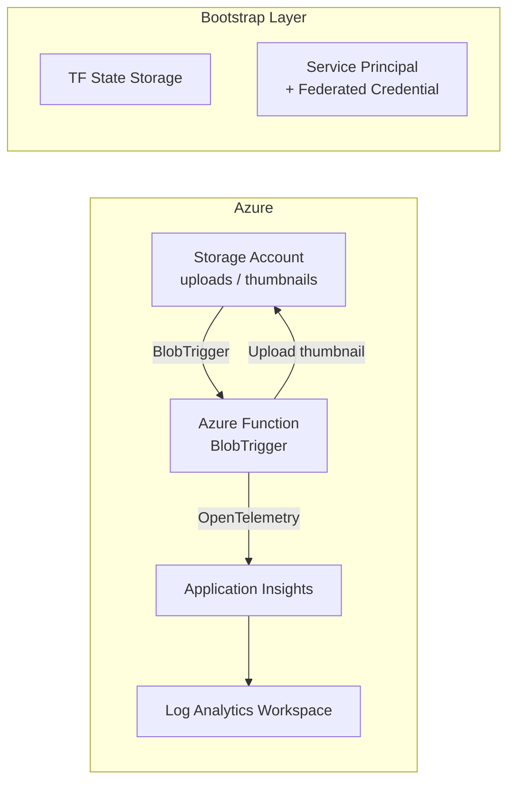

# Image Resizer — Mimari Değerlendirme Raporu

> **Tarih:** 3 Ağustos 2026
> **Kapsam:** [image-resizer](file:///Users/semih/projects/image-resizer) projesinin mevcut durumu
> **Bakış Açısı:** Objektif, production-grade Platform Engineering değerlendirmesi

---

## Proje Özeti

| Bileşen | Detay |
|---|---|
| **Uygulama** | Azure Functions (C# .NET 10, isolated worker) — Blob trigger ile thumbnail oluşturma |
| **IaC** | Terraform (azurerm ~> 4.0), ayrı `bootstrap/` ve `infra/` katmanları |
| **Observability** | Application Insights + Log Analytics Workspace + OpenTelemetry |
| **Kimlik** | Managed Identity (SystemAssigned) + RBAC role assignments |
| **CI/CD** | Workload Identity Federation (bootstrap'ta tanımlı), ancak pipeline henüz yok |
| **Hosting** | Consumption Plan (Y1), Linux |

---

## 1. Mevcut Mimarinin Değerlendirmesi

### Mimari Diyagram (Mevcut Durum)



### Genel Değerlendirme

Proje, kapsamına göre **doğru seviyede tasarlanmış** bir temel üzerine oturuyor. Küçük bir serverless uygulama için gerekli olan temel bileşenler (compute, storage, observability, identity) mevcut ve bunlar arasındaki ilişkiler mantıklı kurulmuş.

Ancak proje henüz **"production-grade" değil**, sadece **"production-grade olmaya aday"** durumda. Bunun nedeni eksiklikleri değil, henüz tamamlanmamış olması. Temel önemli ayrım: **overengineering yok, ama henüz tamamlanmamış alanlar var.**

---

## 2. Production-Grade Açısından Doğru Kararlar

### ✅ 2.1 Managed Identity + RBAC (Mükemmel)

```
storage_uses_managed_identity = true
```

[infra/main.tf#L75-L99](file:///Users/semih/projects/image-resizer/infra/main.tf#L75-L99)

**Bu, projenin en güçlü kararı.** Connection string yerine Managed Identity kullanmak:
- Sıfır secret yönetimi (Key Vault bile gereksiz bu senaryoda)
- Automatic credential rotation
- Least-privilege erişim (RBAC ile scope'lanmış)

Gerçek hayatta genellikle: Büyük şirketlerde bile connection string'ler hâlâ kullanılıyor ve bu ciddi güvenlik açıklarına neden oluyor. Bu kararı ilk günden almak olgunluk göstergesi.

> [!TIP]
> Ancak [ResizeImage.cs#L31-L33](file:///Users/semih/projects/image-resizer/src/ImageResizeFunction/ResizeImage.cs#L31-L33) dosyasında output blob client'ı oluştururken `Environment.GetEnvironmentVariable("AzureWebJobsStorage")` kullanılıyor — bu, Managed Identity ile çelişir. Bu durum aşağıda 3. bölümde detaylı ele alınıyor.

### ✅ 2.2 Bootstrap / Infra Ayrımı (Doğru Pattern)

```
image-resizer/
├── bootstrap/     ← Terraform state backend + CI/CD identity
└── infra/         ← Uygulama altyapısı
```

Bu ayrım, gerçek dünyada **chicken-and-egg** problemini çözer:
- Terraform state'i nerede tutacaksın? → Bootstrap ile oluştur
- CI/CD identity'sini nasıl yaratacaksın? → Bootstrap'ta, manuel bir kez çalıştır

Gerçek hayatta genellikle: Enterprise ortamlarda buna "Layer 0" (foundation) denir. Hashicorp'un kendi referans mimarisi de bu pattern'i önerir.

### ✅ 2.3 Workload Identity Federation (Doğru ve Güncel)

[bootstrap/main.tf#L44-L59](file:///Users/semih/projects/image-resizer/bootstrap/main.tf#L44-L59)

Client secret yerine Federated Identity Credential kullanılmış. Bu:
- GitHub Actions'ın OIDC token ile Azure'a bağlanmasını sağlar
- Sıfır secret rotation gerektirir
- Microsoft'un resmi olarak önerdiği modern yaklaşım

> [!NOTE]
> Çoğu Azure öğrenme materyali hâlâ `az ad sp create-for-rbac --sdk-auth` ile secret-based auth gösterir. Federated credential'ı tercih etmen, güncel best practice'leri takip ettiğini gösteriyor.

### ✅ 2.4 OpenTelemetry Entegrasyonu (İleri Görüşlü)

[Program.cs](file:///Users/semih/projects/image-resizer/src/ImageResizeFunction/Program.cs) ve [host.json](file:///Users/semih/projects/image-resizer/src/ImageResizeFunction/host.json)

```csharp
builder.Services.AddOpenTelemetry().UseFunctionsWorkerDefaults();
```

```json
{ "telemetryMode": "OpenTelemetry" }
```

Vendor-agnostic telemetry standardı kullanmak:
- İleride Application Insights'tan başka bir backend'e (Grafana, Datadog) geçişi kolaylaştırır
- Cloud-native ekosisteme uyumlu
- CNCF standardı

Gerçek hayatta genellikle: Platform ekipleri OpenTelemetry'yi "telemetry abstraction layer" olarak kullanır. Bu, projenin en ileri görüşlü kararlarından biri.

### ✅ 2.5 Consumption Plan (Y1) Seçimi (Doğru)

[infra/main.tf#L60-L66](file:///Users/semih/projects/image-resizer/infra/main.tf#L60-L66)

Bu proje için Consumption Plan tam doğru karar:
- Event-driven, düşük trafik iş yükü
- Maliyet optimizasyonu (kullanılmayan zaman = sıfır maliyet)
- Öğrenme projesi için gereksiz Premium Plan masrafından kaçınılmış

### ✅ 2.6 Naming Convention (Tutarlı)

```
rg-${var.project}-${var.environment}
st${var.project}${var.environment}
func-${var.project}-${var.environment}
```

Azure CAF (Cloud Adoption Framework) naming convention'larına büyük ölçüde uyumlu. `rg-`, `func-`, `ai-`, `law-` prefix'leri doğru.

### ✅ 2.7 Isolated Worker Model (Doğru Tercih)

```xml
<AzureFunctionsVersion>v4</AzureFunctionsVersion>
```
```csharp
use_dotnet_isolated_runtime = true
```

In-process model deprecated. Isolated worker model, Microsoft'un ileriye dönük desteklediği tek model. İlk günden doğru modeli seçmişsin.

---

## 3. Gereksiz Karmaşıklık Oluşturan / Sorunlu Kararlar

### ⚠️ 3.1 Application Kodu İçindeki Çelişki: Managed Identity vs Connection String

[ResizeImage.cs#L31-L34](file:///Users/semih/projects/image-resizer/src/ImageResizeFunction/ResizeImage.cs#L31-L34)

```csharp
var outputClient = new BlobServiceClient(
        Environment.GetEnvironmentVariable("AzureWebJobsStorage"))
    .GetBlobContainerClient("thumbnails")
    .GetBlobClient(name);
```

**Bu, projenin en kritik tutarsızlığı.** Terraform tarafında Managed Identity yapılandırılmış:

```hcl
storage_uses_managed_identity = true
AzureWebJobsStorage__accountName = azurerm_storage_account.sa.name
```

Ancak uygulama kodu, `AzureWebJobsStorage` environment variable'ını bir **connection string** gibi kullanarak `BlobServiceClient` oluşturuyor. Managed Identity aktifken bu değişken bir connection string değil, sadece account name içerir — dolayısıyla **runtime'da hata verecektir** veya local development ayarıyla çalışıyor olabilir.

**Düzeltme:** `DefaultAzureCredential` kullanılmalı:

```csharp
var accountName = Environment.GetEnvironmentVariable("AzureWebJobsStorage__accountName");
var outputClient = new BlobServiceClient(
    new Uri($"https://{accountName}.blob.core.windows.net"),
    new DefaultAzureCredential());
```

**Önem derecesi:** 🔴 Yüksek — Bu bir "çalışır gibi görünen ama production'da patlar" durumu.

### ⚠️ 3.2 RBAC Scope'ları Gereğinden Geniş Olabilir

[infra/main.tf#L95-L111](file:///Users/semih/projects/image-resizer/infra/main.tf#L95-L111)

Üç ayrı role assignment var:
1. `Storage Blob Data Contributor` → ✅ Gerekli (blob okuma/yazma)
2. `Storage Queue Data Contributor` → ❓ Functions runtime için gerekebilir (poison queue)
3. `Storage Table Data Contributor` → ❓ Functions runtime için gerekebilir (timer/lease)

Queue ve Table rolleri, Azure Functions runtime'ının Managed Identity ile çalışması için teknik olarak gereklidir. Ancak bu durumun bir **yorum (comment)** ile açıklanması lazım. Kodun neden bu rolleri verdiği, okuyan kişiye anlaşılır olmalı.

**Öneri:** Her role assignment'a bir comment ekle:

```hcl
# Functions runtime requires Queue Data Contributor for poison queue handling
# when using Managed Identity (storage_uses_managed_identity = true)
```

**Önem derecesi:** 🟡 Orta — Teknik olarak doğru, ama intent belirsiz.

### ⚠️ 3.3 Terraform State Hâlâ Local

[infra/terraform.tfstate](file:///Users/semih/projects/image-resizer/infra) dosyası repoda mevcut.

Bootstrap'ta remote state backend için storage account ve container oluşturulmuş ([bootstrap/main.tf#L23-L41](file:///Users/semih/projects/image-resizer/bootstrap/main.tf#L23-L41)), ancak `infra/main.tf`'te backend configuration yok:

```hcl
terraform {
  required_providers { ... }
  # ← backend "azurerm" { ... } eksik
}
```

Bu, bootstrap'ın amacıyla çelişiyor. Remote state backend kurulmuş ama kullanılmıyor.

**Önem derecesi:** 🔴 Yüksek — `terraform.tfstate` dosyası local'de, git'e commit edilmiş olabilir (`.gitignore`'da `infra/*.tfstate` var ama dosya zaten mevcut). State dosyası hassas bilgiler içerir (resource ID'leri, output değerleri).

### ⚠️ 3.4 CI/CD Pipeline Henüz Yok

`.github/workflows/` dizini boş. Workload Identity Federation hazırlanmış ama onu kullanan bir pipeline yok.

**Önem derecesi:** 🟡 Orta — Henüz yapım aşamasında olabilir, ama bootstrap'taki yatırım (Service Principal + Federated Credential) havada kalıyor.

### ⚠️ 3.5 Subscription ID Git'e Commit Edilmiş

[bootstrap/terraform.tfvars](file:///Users/semih/projects/image-resizer/bootstrap/terraform.tfvars) ve [infra/terraform.tfvars](file:///Users/semih/projects/image-resizer/infra/terraform.tfvars) içinde subscription ID açık metin olarak var. `.gitignore`'da sadece `infra/terraform.tfvars` var, `bootstrap/terraform.tfvars` gitignore'da yok.

Subscription ID tek başına büyük bir risk değildir (sadece ID, credential değil), ancak enterprise ortamda bu bir compliance violation olabilir.

**Önem derecesi:** 🟢 Düşük (öğrenme projesi için), 🟡 Orta (production mindset için).

---

## 4. Gerçek Şirketlerde Bu Ölçekte Bir Proje Nasıl Tasarlanır?

Gerçek hayatta, bu ölçekteki (tek function, tek storage account) bir proje için tipik mimari:

### Startup / Küçük Ekip (1-5 kişi)

```
├── infra/
│   └── main.tf              ← Tüm kaynaklar tek dosyada (sorun değil)
├── src/
│   └── FunctionApp/
├── .github/workflows/
│   ├── ci.yml                ← Build + test
│   └── cd.yml                ← Deploy (veya tek unified pipeline)
└── README.md
```

- **IaC:** Terraform veya Bicep, remote state
- **CI/CD:** GitHub Actions veya Azure DevOps, tek branch'ten deploy
- **Observability:** Application Insights (yeterli)
- **Identity:** Managed Identity (baştan doğru yapılır)
- **Environments:** Genelde sadece `dev` ve `prod` (staging yoktur)

### Enterprise / Platform Team (50+ kişi)

```
├── platform/
│   ├── modules/              ← Reusable Terraform modules
│   ├── environments/
│   │   ├── dev/
│   │   ├── staging/
│   │   └── prod/
│   └── policies/             ← Azure Policy definitions
├── apps/
│   └── image-resizer/
│       ├── infra/            ← Sadece app-specific resources
│       └── src/
└── .github/workflows/
    └── deploy.yml            ← Matrix deployment across envs
```

- Her şey module'ler üzerinden
- Policy-as-Code (Azure Policy, OPA)
- Separate state files per environment
- Landing Zone pattern

### 📍 Senin Projenin Konumu

Projen, startup/küçük ekip seviyesinde doğru tasarlanmış. Enterprise pattern'leri uygulamaya çalışmamışsın ve **bu doğru bir karar.** Bu ölçekte module'ler, environment matrix'leri veya policy engine'ler gereksiz karmaşıklık yaratır.

---

## 5. Platform Engineer Bakış Açısından Eksikler

Aşağıdaki eksikler "hata" değil, projenin production-grade olması için tamamlanması gereken adımlar:

### 🔲 5.1 CI/CD Pipeline (Yüksek Öncelik)

Platform Engineering'in temel taşı: **her değişiklik pipeline'dan geçer.** Minimum:
- `terraform plan` → PR'da otomatik çalışır
- `terraform apply` → Main branch'e merge sonrası
- Function app build + deploy → Main branch'e merge sonrası

### 🔲 5.2 Remote Backend Bağlantısı (Yüksek Öncelik)

Bootstrap ile oluşturulan remote state backend, `infra/main.tf`'e bağlanmalı:

```hcl
terraform {
  backend "azurerm" {
    resource_group_name  = "rg-tfstate"
    storage_account_name = "satfstateimgresizer"
    container_name       = "tfstate"
    key                  = "image-resizer.tfstate"
  }
}
```

### 🔲 5.3 Environment Stratejisi (Orta Öncelik)

`var.environment = "dev"` tanımlı ama sadece tek environment var. En az `dev` + `prod` ayrımı olmalı. Ancak bu, CI/CD pipeline tamamlandıktan sonra ele alınmalı.

### 🔲 5.4 Terraform Provider Version Pinning (Düşük Öncelik)

`~> 4.0` çok geniş bir constraint. Lock dosyası (`4.81.0`) mevcut olduğu için pratikte sorun yaratmaz, ancak production'da genellikle `~> 4.81` gibi daha dar bir constraint tercih edilir.

### 🔲 5.5 README ve Dokümantasyon

[README.md](file:///Users/semih/projects/image-resizer/README.md) boş. Minimum:
- Proje amacı
- Mimari diyagram
- Local development kurulumu
- Deployment adımları
- Prerequisite'ler (Azure CLI, Terraform, .NET SDK)

### 🔲 5.6 Alerting ve Monitoring Eksik

Application Insights var ama alert kuralları yok. Production'da minimum:
- Function failure rate > X% → Alert
- Function duration > Y saniye → Alert
- Dead-letter / poison message → Alert

### 🔲 5.7 Storage Account Güvenlik Hardening

Mevcut ayarlar:
```hcl
account_replication_type = "LRS"     # ← Dev için OK
# min_tls_version eksik (default 1.0 olabilir)
# https_traffic_only_enabled eksik
```

Bootstrap storage account'ta `min_tls_version = "TLS1_2"` var ama infra'daki storage'da yok. Tutarsızlık.

---

## 6. Korunacak ve Sadeleştirilecek Kısımlar

### ✅ Kesinlikle Korunmalı

| Karar | Neden |
|---|---|
| Managed Identity + RBAC | Production-grade security temeli |
| Bootstrap / Infra ayrımı | Doğru IaC lifecycle yönetimi |
| Workload Identity Federation | Modern, secret-free CI/CD auth |
| OpenTelemetry | Vendor-agnostic observability |
| Isolated worker model | Microsoft'un desteklediği tek yol |
| Consumption Plan | Doğru maliyet/performans dengesi |
| Naming convention | Azure CAF uyumlu |

### 🔧 Düzeltilmeli (Sadeleştirme Değil, Bug Fix)

| Konu | Aksiyon |
|---|---|
| `ResizeImage.cs` connection string çelişkisi | `DefaultAzureCredential` ile değiştir |
| Terraform remote state bağlantısı | `backend "azurerm"` block'u ekle |
| Local state dosyası | Remote'a migrate et, local'den sil |

### ➕ Eklenecekler (Öncelik Sırasıyla)

| Sıra | Konu | Neden |
|---|---|---|
| 1 | CI/CD Pipeline | Platform Engineering'in çekirdeği |
| 2 | Remote backend bağlantısı | IaC lifecycle'ın temeli |
| 3 | README | Self-documenting project |
| 4 | Storage hardening (TLS, HTTPS) | Security baseline |
| 5 | Basic alerting | Operasyonel sürdürülebilirlik |
| 6 | Multi-environment (dev/prod) | CI/CD pipeline sonrası doğal adım |

### ❌ Yapılmaması Gerekenler (Bu Aşamada)

| Konu | Neden |
|---|---|
| Terraform modules oluşturma | Bu ölçekte gereksiz abstraction |
| Multi-region deployment | Tek function için overkill |
| API Management / Front Door | Trafik yok, karmaşıklığı artırır |
| Key Vault ekleme | Managed Identity zaten secret'ı ortadan kaldırdı |
| Kubernetes / Container Apps | Serverless zaten doğru seçim |
| Azure Policy / Governance | Tek proje, tek subscription |
| Terragrunt / Pulumi geçişi | Terraform yeterli, araç değişikliği öğrenmeyi yavaşlatır |

---

## 7. Projenin Konumlandırması

```
┌──────────────────────────────────────────────────────────────────────┐
│                                                                      │
│  "Azure Öğrenme"        Senin projen          "Production-Grade"     │
│  (Portal clicker)         burada               (Enterprise)         │
│       ●─────────────────────●──────────────────────●                 │
│                             ▲                                        │
│                             │                                        │
│                    "Production-Aware                                 │
│                     Learning Project"                                │
│                                                                      │
└──────────────────────────────────────────────────────────────────────┘
```

### Bu ne demek?

- **"Azure Öğrenme Projesi" değil** — Portal'dan kaynak oluşturup bırakmamışsın. IaC, Managed Identity, OpenTelemetry gibi production pratiklerini baştan uygulamışsın.

- **"Production-Grade" henüz değil** — CI/CD pipeline yok, remote state bağlantısı yok, alerting yok, code'da bir Managed Identity çelişkisi var.

- **"Production-Aware Learning Project"** — Bu tanım projenin mevcut durumunu en iyi tarif ediyor. Production'da nasıl yapılacağını bilerek, öğrenme projesi bağlamında uygulamaya çalışıyorsun.

### Bu konum doğru mu?

**Evet, bu tam olarak doğru konum.** Nedenleri:

1. **Eğer tamamen production-grade olsaydı:** Bu ölçekte bir proje için overengineering olurdu. Module'ler, policy engine'ler, multi-region — hepsi öğrenme hızını yavaşlatır.

2. **Eğer tamamen öğrenme projesi olsaydı:** Portal'dan kaynak oluşturup öğrenme not defterine yazdığın bir çalışma olurdu. Portfolio değeri sıfır, gerçek iş deneyimine aktarılabilirliği düşük.

3. **Production-aware bir öğrenme projesi:** Doğru kararları almayı öğrenirken, gereksiz karmaşıklıktan kaçınıyorsun. **Bu, öğrenme için optimal nokta.**

---

## 8. Sonuç

### Karar: **Doğru yönde ilerliyor — birkaç düzeltme ve tamamlama ile hedeflenen seviyeye ulaşır.**

Bu "övgü" değil, teknik bir tespit. Gerekçelerim:

### Neden "doğru yönde"?

1. **Mimari kararlar tutarlı.** Managed Identity, OpenTelemetry, isolated worker, bootstrap ayrımı — bunların hepsi birbiriyle uyumlu bir vizyonu gösteriyor. Rastgele teknoloji eklenmemiş.

2. **Overengineering yok.** Bu ölçekte module yazmamışsın, multi-region denemedin, gereksiz abstraction layer eklememişsin. Bu, mühendislik olgunluğunun göstergesi: "Ne zaman yapmamam gerektiğini bilmek."

3. **Öğrenme hedefleriyle uyumlu.** AZ-104 (identity, storage, monitoring), AZ-305 (architecture decisions), AZ-400 (CI/CD, IaC) — projedeki her karar bu sertifikaların kapsamında.

### Neden "henüz tam production-grade değil"?

1. **Kod-infra tutarsızlığı** (`DefaultAzureCredential` vs connection string) — Bu, "infrastructure doğru ama application uymuyor" durumu. Platform Engineer'ın görevi bu tutarlılığı sağlamak.

2. **CI/CD yok** — Platform Engineering'in en temel çıktısı "self-service, otomatik deployment pipeline"dır. Bu olmadan platform engineering iddiası eksik kalır.

3. **Remote state bağlantısı eksik** — Bootstrap yatırımı karşılığını almamış.

### Aksiyon Planı (Öncelik Sırasıyla)

```
Şimdi (Bugün)
├── 1. ResizeImage.cs → DefaultAzureCredential düzelt
├── 2. infra/main.tf → backend "azurerm" block ekle
├── 3. terraform state migrate (local → remote)
└── 4. Storage account hardening (min_tls_version)

Bu Hafta
├── 5. GitHub Actions CI/CD pipeline oluştur
│   ├── PR: terraform plan + dotnet build
│   └── Main: terraform apply + func deploy
└── 6. README yaz

Sonraki Adım
├── 7. Basic alerting (failure rate, duration)
├── 8. dev/prod environment ayrımı
└── 9. Proje dokümantasyonu (ADR'ler)
```

### Son Not

Bu proje tam olarak istediğin şeyi yapıyor: **"Bu sistemi iki yıl sonra nasıl yönetirim?" sorusunu sormayı öğretmek.** Managed Identity, OpenTelemetry, IaC lifecycle, Workload Identity Federation — bunlar bir Backend Engineer'ın tipik olarak bilmediği, ama bir Platform Engineer'ın temel araçları olan şeyler.

Projenin ölçeği küçük olması önemli değil. Önemli olan, küçük ölçekte doğru kararları alma alışkanlığı edinmek. Bu alışkanlıklar, ölçek büyüdüğünde otomatik olarak doğru mimari kararlara dönüşür.

**Eleştiri:** Projedeki tek gerçek risk, "doğru infrastructure kararları alırken application code'un tutarsız kalması." Bu, Backend Engineer → Platform Engineer geçişinin tipik bir tuzağı: infrastructure tarafına odaklanırken, application code'un infrastructure kararlarıyla uyumlu olması gerektiğini atlamak. Bu gap'i kapatmak, tam olarak hedeflediğin dönüşümün parçası.
